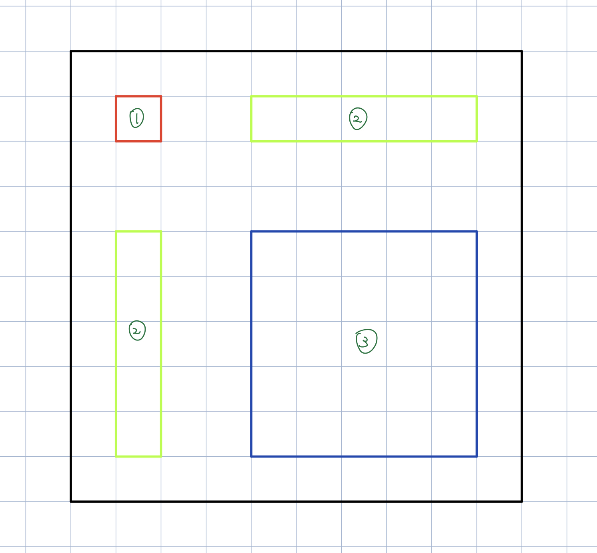

# 实验三：全源最短路

## 实现方法

### 初版实现

对于 $n\times n$ 的矩阵，我们取 $p = \lceil \frac{n}{32} \rceil$，将矩阵分割成 $p\times p$ 个子矩阵块，其中对于溢出的部分直接取距离的上限，不难发现这样并不会影响整体的答案，同样的，我们这里将每个线程块的大小取为 $32\times 32$。这里之所以取 $32$，是因为一方面一个 warp 是 SIMD 运行 $32$ 个线程，我们取 $32\times 32$ 可以很大程度上避免 bank conflict，另一方面线程块大小的限制为 $1024$，由于我们的矩阵是方阵，因此这里的子矩阵也取为方阵更为合适。

之后，我们大体的流程和助教给出的提示类似，这里我们每个 $32\times 32$ 大小的线程块负责处理 $160\times 160$ 的子矩阵，即 $5\times 5$ 的子矩阵块，这里之所以取 $160$ 是出于吞吐量和 shared memory 大小的综合限制。我们进行 $m = \lceil \frac{n}{160} \rceil$ 轮迭代，对于第 $i$ 轮迭代，在每个线程块中，首先我们将$(i,i)$ 的子矩阵块搬运到共享内存，运行一遍块内的 Floyd，注意这里我们是 $32\times 32$ 的线程块对应 $32\times 32$ 的矩阵块，因此这里每个线程恰好对应矩阵块中的一个元素。接着，对于编号为 $(x,y)$ 的线程块，让其负责 $(160x,160y)$ 至 $(160(x + 1), 160(y + 1))$这个 $160\times 160$ 的子矩阵块的计算，为了完成这部分的计算，我们还需要计算以 $(160x,32i)$ 为左上角，大小为 $160\times 32$ 的矩阵块和以 $(32i,160y)$ 为左上角，大小为 $32\times 160$ 的矩阵块的 Floyd，最后即可计算出我们对应的 $160\times 160$ 的 Floyd 了。

如上图所示，假设我们进行到了第二轮迭代，那么我们会将整个 $n\times n$ 的矩阵划分成 $32\times 32$ 的小矩阵，即上图中的小方格。然后将矩阵不想交的分割成若干个蓝色方块，每个线程块计算蓝色方块中的最短路。为了计算蓝色方块中的信息，我们以此计算红色和绿色的部分即可。

这里一个线程块负责多个矩阵块的好处在于，很好的减少了不必要的计算量，也充分利用了 shared memory，最优的加速比可以达到 18x。

### 改进优化

我们可以发现，这里矩阵块中的值不会超过 $10^4$，因此可以使用 `short` 进行存储。因此我们可以将其在 shared memory 里的存储从 $5$ 改为 $9$，进一步减少不必要的计算量。其中我注意到因为 cuda 里实际的计算使用的都是 $32$ bit，因此使用 `short` 中间会增加数据类型的转换，从而导致实际计算变慢。因此我们只有进行最大限度的提升才能弥补这方面计算的差距，使得速度变得更快。

再加上一点常数上的优化，把加速比从原本的 18x 提升到了 30x。

## 加速比

|   $n$   | 运行时间 $(\mathrm{ms})$ | 朴素参考$(\mathrm{ms})$ |     加速比     |
| :-----: | :----------------------: | :---------------------: | :------------: |
| $1000$  |        $4.310860$        |       $14.751605$       | $3.421963367$  |
| $2500$  |       $20.847234$        |      $376.868656$       | $18.077633512$ |
| $5000$  |       $106.138431$       |      $2970.720057$      | $27.98910846$  |
| $7500$  |       $336.933362$       |     $10012.619534$      | $29.716913382$ |
| $10000$ |       $742.162188$       |     $22619.657030$      | $30.478051019$ |

